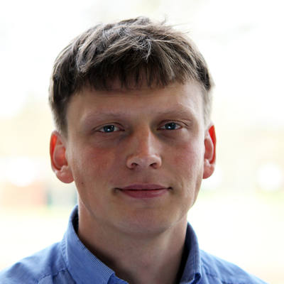
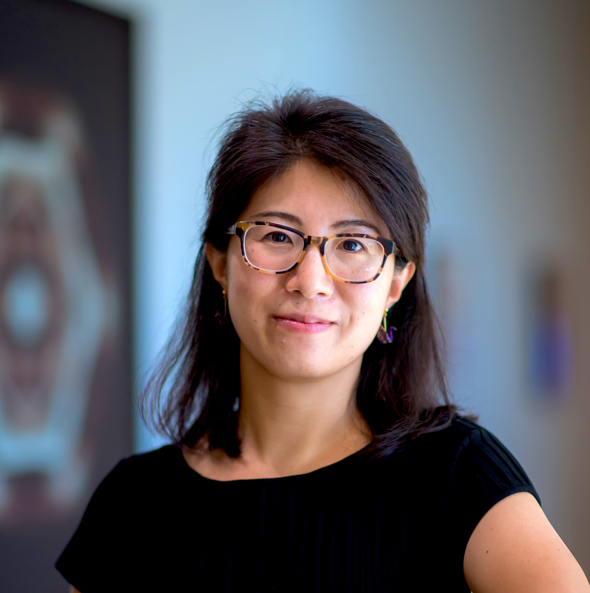
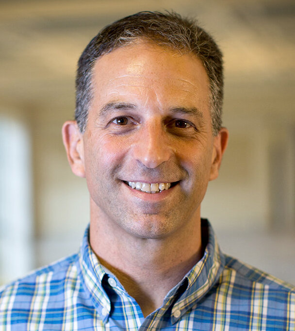

<style type="text/css">


.d-title {
  background-image: url("images/ubc.jpg");
  background-size: cover; /* Cover the entire area */
  background-position: center; /* Center the background image */
  color: white;  /* Adjust text color for better visibility */
  text-align: center; /* Center the text */
}

</style>

<div class="center-text">

**SynBio6.0 (May 16-17, 2024)** aims to bring the research community together to celebrate Canadian progress in this exciting and fast-growing field. The goal of this event it to promote collaborations and the exchange of ideas between synthetic biology research groups in Canada. 

<div class="center-text">
  Find the conference abstract book <a href="path_to/SynBio Abstract Book.pdf"style="color: #133E67; font-weight: bold;"> here</a>.
  
</div>

# Keynote Speakers

<div class="organizers-container">
<div class="organizer-profile">
  
  <h3><a href="https://www.sanger.ac.uk/group/parts-group/" target="_blank">Leopold Parts</a></h3>
  Group Lead
  <br>
  Wellcome Sanger Institute
</div>
<div class="organizer-profile">
  
  <h3><a href="https://lilab.wi.mit.edu/" target="_blank">Pulin Li</a></h3>
  Professor
  <br>
  Whitehead Institute, MIT
</div>

<div class="organizer-profile">
  
  <h3><a href="http://www.theshapirolab.com/" target="_blank">Rebecca Shapiro</a></h3>
  Associate Professor
  <br>
  University of Guelph
</div>

<div class="organizer-profile">
  
  <h3><a href="weiss-lab.mit.edu" target="_blank">Ron Weiss</a></h3>
  Professor
  <br>
  MIT
</div>
</div>

This event provides a forum for our trainees to develop their skills in the science and business of synthetic biology. Trainees are invited to attend tutorial workshops, participate in discussion of synthetic biology training programs, to present their work through oral and poster presentations, and to network with other synbio researchers.

</div>

<br> 

<div class="center-text"">
<a href="registration.html" class="register-button">Register and Present →</a>
</div>

::: center-text
<h3>Important Dates</h3>

|                                  |             Date             |
|----------------------------------|:----------------------------:|
| **Registration Opens**           |    **February 12th 2024**    |
| **Registration Ends**            |       **May 9th 2024**       |
| **Abstract Submission Deadline** |     **April 26th 2024**      |
| **Conference**                   | **May 16th - May 17th 2024** |
:::

<div class="center-text">
## Venue

AMS Student Nest, 6133 University Blvd, UBC, Vancouver, BC V6T 1Z1
</div>


```{r, echo=FALSE, layout="l-screen-inset shaded"}
library(leaflet)
leaflet() %>%
  addTiles() %>%  # Add default OpenStreetMap map tiles
  addMarkers(lng=-123.249804, lat=49.266421, popup="6133 University Blvd, UBC, Vancouver, BC")
```

