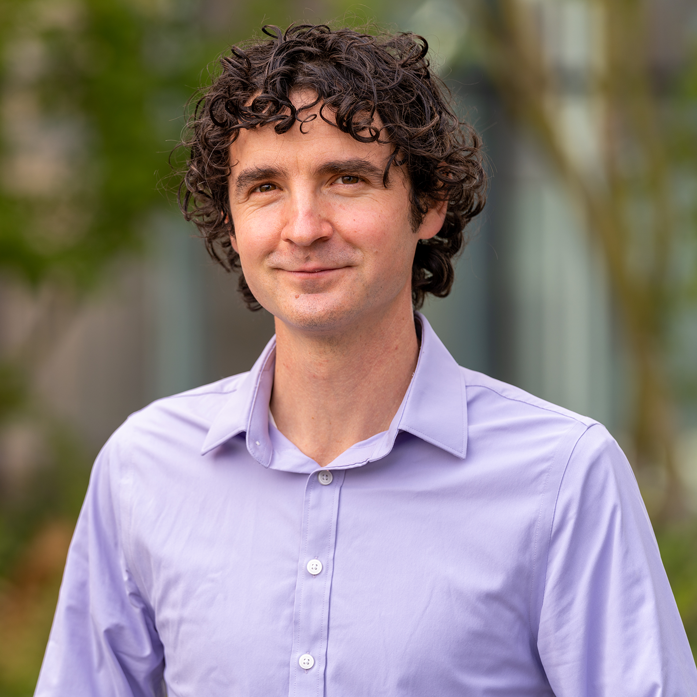

 The **Cascadia Advanced Genomic Technologies (CAGT) Meeting** aims to unite the research community across the Pacific Northwest to foster collaboration and drive innovation in mammalian genomics. This conference will spotlight cutting-edge advancements in genomic technologies while addressing critical challenges within the field. Themes that will be covered in this conference includes:
 
  <strong><ol style="list-style-position: inside;">
      <li>Synthetic Biology</li>
      <li>Celluar engineering</li>
      <li>Genomics</li>
      <li>Machine learning and computational biology</li>
  </ol></strong>
  
 

  The inaugural CAGT Meeting will take place at the **University of British Columbia** on **June 19-20**. Registration is now open!
  
  <a href="registration.html" class="register-button">Register and Present →</a>
  

## Keynote Speaker

  

    
    <a href="https://www.plesalab.org/" target="_blank" style="font-size: 30px; font-weight: bold;">Calin Plesa</a>
     
    Assistant Professor of Bioengineering,
     
    University of Oregon
  

  

    Calin Plesa is an Assistant Professor in the Dept. of Bioengineering at the Phil and Penny Knight Campus for Accelerating Scientific Impact at the University of Oregon. He received a BASc in Engineering Physics from Simon Fraser University in Canada, MSc in Nanoscience from Chalmers University of Technology, and a PhD from Delft University of Technology in Bionanoscience, studying solid state nanopores. As an HFSP Fellow in the Kosuri lab at UCLA he developed DropSynth, a low-cost scalable method to synthesize thousands of genes. Calin started his lab at the University of Oregon in 2019 and has been developing methods to study and engineer biological systems at scale. He has been the recipient of a CASI award from the Burroughs Wellcome Fund, as well as a New Innovator Award from the NIH. 
  

