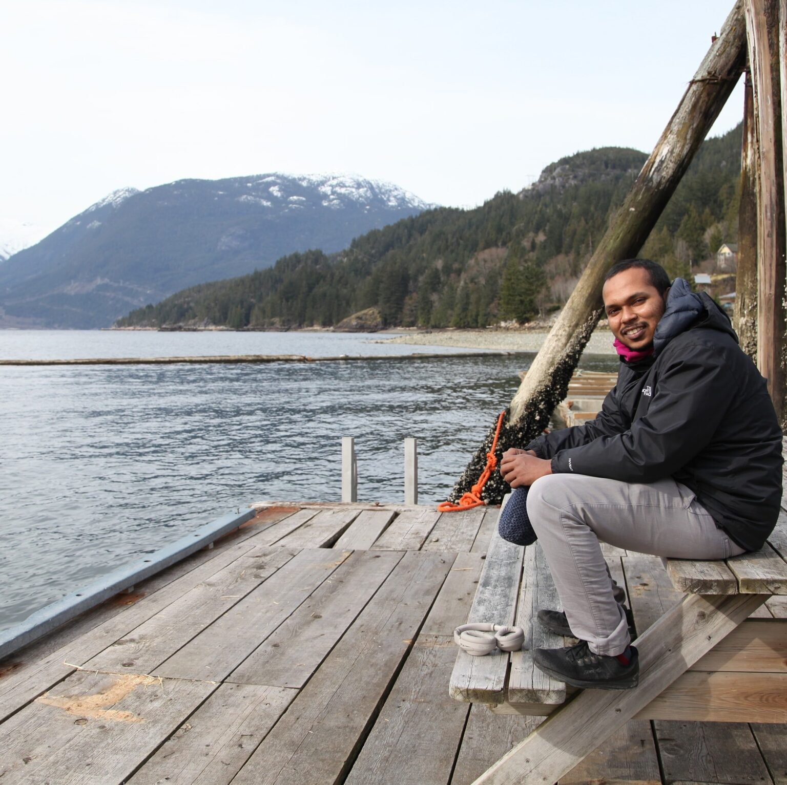

# Keynote Speakers

  
  <h3><a href="https://www.sanger.ac.uk/group/parts-group/" target="_blank">Leopold Parts</a></h3>
  Group Lead
   
  Wellcome Sanger Institute

  
  <h3><a href="https://lilab.wi.mit.edu/" target="_blank">Pulin Li</a></h3>
  Professor
   
  Whitehead Institute, MIT

  
  <h3><a href="http://www.theshapirolab.com/" target="_blank">Rebecca Shapiro</a></h3>
  Associate Professor
   
  University of Guelph

  
  <h3><a href="weiss-lab.mit.edu" target="_blank">Ron Weiss</a></h3>
  Professor
   
  MIT

# Organizers {#organizers}

  
  <h3><a href="https://deboer.bme.ubc.ca/" target="_blank">Carl de Boer</a></h3>
  Assistant Professor
   
  UBC
  

  <a href="mailto:carl.deboer@ubc.ca"><i class="fas fa-envelope"></i></a>
  

  
  <h3><a href="https://shakiba.bme.ubc.ca/" target="_blank">Nika Shakiba</a></h3>
  Assistant Professor
   
  UBC
  

  <a href="mailto:nika.shakiba@ubc.ca"><i class="fas fa-envelope"></i></a>
  

  
  <h3><a href="https://yachie-lab.org/" target="_blank">Nozomu Yachie</a></h3>
  Associate Professor
   
  UBC
  

  <a href="mailto:nozomu.yachie@ubc.ca"><i class="fas fa-envelope"></i></a>
  

  
  <h3>Abdul Muntakim Rafi</h3>
  Graduate Student
   
  UBC
  

  <a href="mailto:abdulmuntakim.rafi@ubc.ca"><i class="fas fa-envelope"></i></a>
  

  
  <h3>Asfar Lathif Salaudeen</h3>
  Graduate Student
   
  UBC
  

  <a href="mailto:asfar.lathif@ubc.ca"><i class="fas fa-envelope"></i></a>
  

  
  <h3>Will Cheney</h3>
  Graduate Student
   
  UBC
  

  <a href="mailto:wcheney@student.ubc.ca"><i class="fas fa-envelope"></i></a>
  

