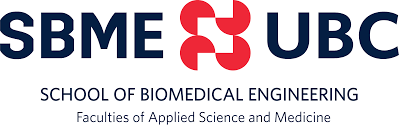
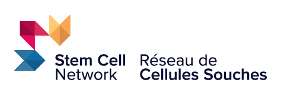
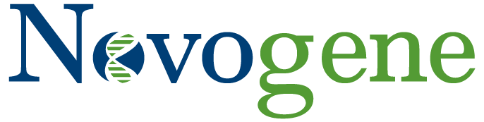
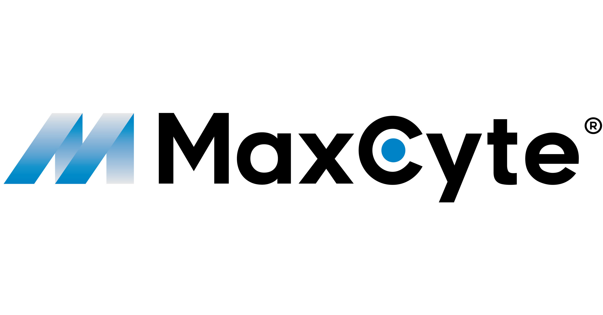
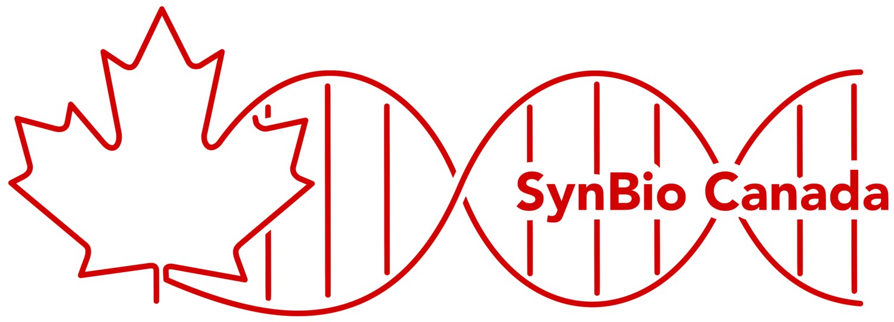
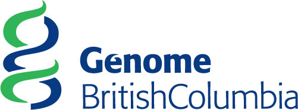
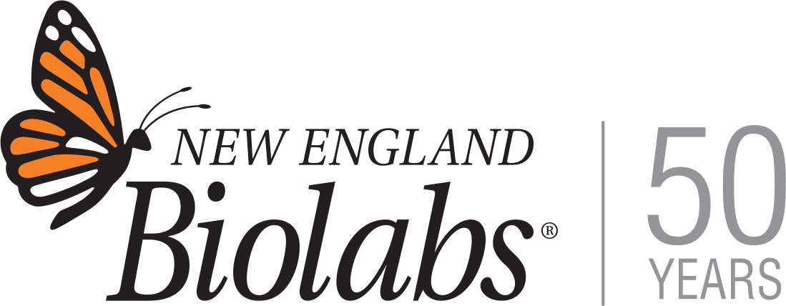
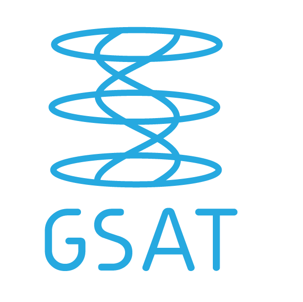
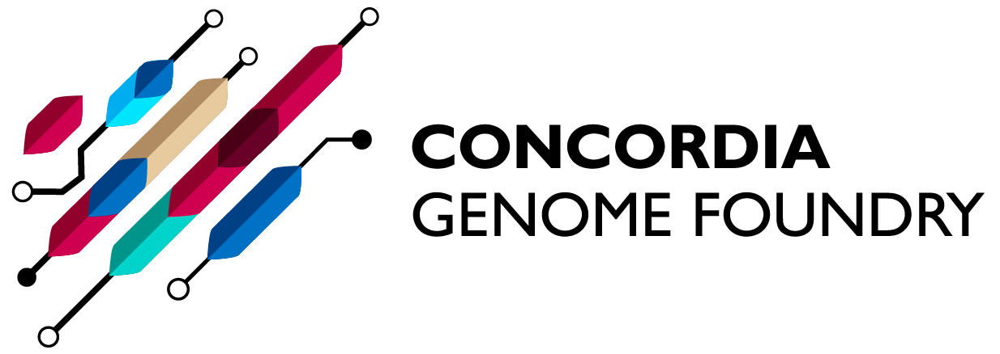

# Gold

  
  <h3><a href="https://bme.ubc.ca/" target="_blank">School of Biomedical Engineering, UBC</a></h3>

# Silver

  
  <h3><a href="https://stemcellnetwork.ca/" target="_blank">Stem Cell Network</a></h3>

  
  <h3><a href="https://www.novogene.com/us-en/" target="_blank">Novogene</a></h3>

  
  <h3><a href="https://maxcyte.com/" target="_blank">MaxCyte</a></h3>

# Bronze

  
  <h3><a href="https://www.synbiocanada.org/" target="_blank">SynBio Canada</a></h3>

  
  <h3><a href="https://www.genomebc.ca/" target="_blank">Genome BC</a></h3>

  
  <h3><a href="https://www.neb.com/en" target="_blank">NEB</a></h3>

  
  <h3><a href="https://www.gsat.ubc.ca/" target="_blank">Genome Science and Technology, UBC</a></h3>

  
  <h3><a href="https://www.ontariogenomics.ca/" target="_blank">Ontario Genomics</a></h3>

  
  <h3><a href="https://www.concordia.ca/research/genome-foundry.html" target="_blank">Concordia Genome Foundry</a></h3>

